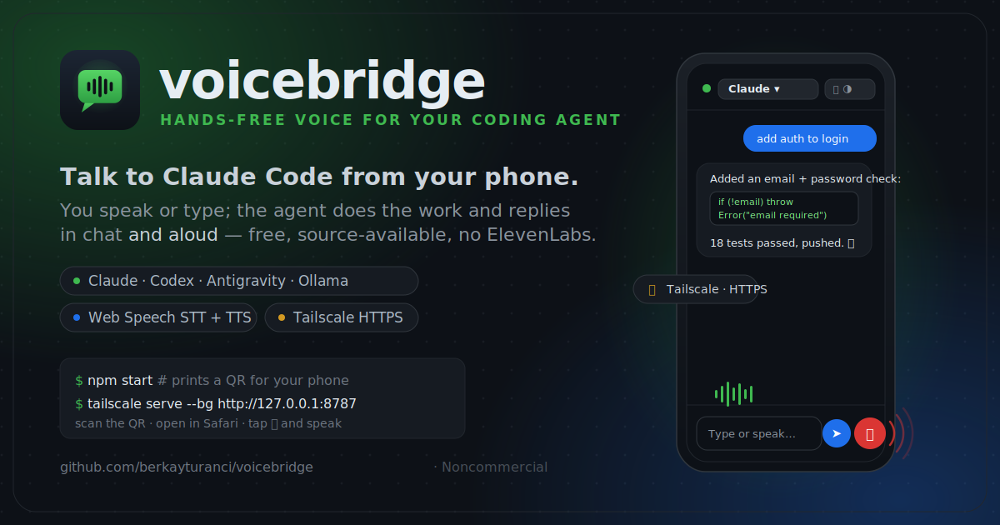

<p align="center">
  
</p>

# voicebridge

[](https://github.com/berkayturanci/voicebridge/actions/workflows/ci.yml)
[](package.json)
[](LICENSE)
[](#agents-sessions--modes)

**Hands-free, two-way voice for your coding agent from your phone — free, source-available, no ElevenLabs.**

**v0.8.0:** Download the Mac host app DMG, choose one workspace, start the
bridge, verify Tailscale, and pair the native mobile app by scanning the desktop
QR code.

You speak **or type** on your phone, a coding agent (running on your Mac/Linux
box) does the work, and the reply streams back as chat **and** spoken audio —
like a phone call with your agent, with a keyboard when you want one.

<p align="center"></p>
<p align="center"><em>Type or speak; the agent replies in chat and aloud.</em></p>

- 🤖 **Multiple agents** — Claude Code, **Codex**, **Antigravity**, and **Ollama**
  (a fully-local open-source model), selectable per session, each with autonomy
  **modes** (ask → full-auto).
- 🗂️ **Multiple sessions** — run several conversations in parallel (e.g. "Claude on
  repo A", "Codex on repo B") and switch between them in the UI.
- ⌨️🎙️ **Type or speak** — a Claude-Code-like chat with a text box *and* a mic;
  replies render with code blocks and are read aloud.
- 🎙️ **Speech-to-text** runs in your phone's browser by default, or through your
  own local Whisper command / streaming WebSocket transcriber; 🔊
  **text-to-speech** stays in the browser — no per-minute voice cost.
- ⚡ **Streaming** — the reply is spoken **sentence-by-sentence as it's generated**,
  not after the whole turn finishes, with a **Stop** button to cut it off.
- 🧩 A **tiny Node bridge** (one dependency: `qrcode-terminal`) relays the text to
  the agent CLI on your machine and streams its reply back.
- 🔒 Reached over **Tailscale** (your private network) with real HTTPS, with an
  optional **shared access token** — your code never touches a third-party voice
  service.
- 🗣️ Optional **fully-local speech-to-text** via your own Whisper command
  (`STT_MODE=whisper`) or a local streaming Whisper WebSocket transcriber
  (`STT_MODE=whisper-stream`), so even the transcription stays on your machine.

> Honest scope: for Claude/Codex/Antigravity the **model** runs in its vendor's
> cloud (that's how those CLIs work); with the **Ollama** backend the model runs
> fully locally. voicebridge just removes the *voice* middleman (ElevenLabs)
> and its limits. Speech recognition on iOS uses Apple's free dictation service;
> text-to-speech is fully on-device.
>
> Agent support: the **Claude** backend is fully implemented and tested. The
> **Codex** (`codex exec`) and **Antigravity** (`agy --print`) backends use the
> same secure stdin prompt style as [ai-jury](https://github.com/berkayturanci/ai-jury)
> and stream their plain-text stdout. Conversation continuity is built-in for
> Claude (`--continue`), Codex (`codex exec resume`), and Antigravity
> (`--conversation` / `--continue`); see
> [docs/configuration.md](docs/configuration.md) for override hooks.

---

## Quickstart

### Easiest: Mac host app

Download the unsigned Apple Silicon DMG:

https://github.com/berkayturanci/voicebridge/releases/download/v0.8.0/voicebridge-0.2.0-arm64.dmg

Open it, choose your project folder and agent, set your Tailscale HTTPS URL,
then scan the pairing QR from the iOS/Android app. Full walkthrough:
[docs/mac-desktop-host.md](docs/mac-desktop-host.md).

### From source

```bash
git clone https://github.com/berkayturanci/voicebridge.git voicebridge && cd voicebridge && npm install
cp .env.example .env                                  # set PROJECT_DIR + ACCESS_TOKEN
CLAUDE_BIN=$(which claude) npm start                  # prints a QR for your phone
tailscale serve --bg --https=443 localhost:8787       # expose over HTTPS (separate terminal)
```

Then open the printed `https://…ts.net` URL in your phone's browser (Safari on
iOS) and tap 🎤 or just type. New to it? See [Requirements](#requirements),
[Troubleshooting](#troubleshooting), and the step-by-step
[mobile voice setup](docs/mobile-voice-setup.md) (why the mic needs HTTPS).

## Requirements

- A computer (macOS/Linux) with **Claude Code** installed and logged in
  (`npm i -g @anthropic-ai/claude-code`, then `claude` → `/login`).
- **Node.js ≥ 18** (`brew install node`).
- **Tailscale** on both the computer and the phone (`brew install --cask tailscale`,
  and the Tailscale app from the App Store). Free.
- iPhone/iPad: open in **Safari** (do **not** "Add to Home Screen" — installed PWAs
  can't use the microphone on iOS).

## Setup

### 1. On your computer

```bash
git clone https://github.com/berkayturanci/voicebridge.git voicebridge
cd voicebridge
npm install            # qrcode-terminal (web-push is optional, for real push)

# Configure with a .env file (or plain env vars):
cp .env.example .env   # then edit: PROJECT_DIR, ACCESS_TOKEN, …

# Start the bridge (binds to 127.0.0.1:8787 by default)
npm start
```

Any variable in `.env` is loaded at startup (real environment variables win).

On startup the bridge prints a **QR code** for the phone URL — scan it to open
the UI (and, when `ACCESS_TOKEN`/`PUBLIC_URL` are set, to authorize on open).

### 2. Expose it to your phone over HTTPS (Tailscale)

Web Speech needs a secure context (HTTPS) — over plain `http://<lan-ip>` a
phone's browser disables the mic. Tailscale gives your machine a real HTTPS cert
automatically:

```bash
tailscale serve --bg --https=443 localhost:8787
tailscale serve status     # shows the https://<your-machine>.<tailnet>.ts.net URL
```

The **first time** you run `tailscale serve`, you may have to enable the feature
once for your tailnet — it prints a `login.tailscale.com/f/serve?node=…` link;
open it and toggle Serve on. Full walkthrough (and the *why*) in
[docs/mobile-voice-setup.md](docs/mobile-voice-setup.md).

### 3. On your phone

1. Make sure Tailscale is **connected** (same account).
2. Open the `https://<your-machine>.<tailnet>.ts.net` URL in **Safari**.
3. Tap the 🎤 button, allow the microphone, and **speak**.
4. Toggle **Eller serbest / Hands-free** for a continuous back-and-forth loop.

That's it — talk, and Claude Code talks back. 🎧

---

## Configuration

| Env var        | Default              | Meaning                                            |
|----------------|----------------------|----------------------------------------------------|
| `PORT`         | `8787`               | Port the bridge listens on                         |
| `HOST`         | `127.0.0.1`          | Bind address (keep local; expose via `tailscale serve`) |
| `PUBLIC_URL`   | _(none)_             | Public URL shown in the startup QR (e.g. your Tailscale `https://…ts.net`). Falls back to `http://HOST:PORT`. |
| `PROJECT_DIR`  | current directory    | Default working directory for new sessions         |
| `AGENT`        | `claude`             | Default agent for the boot session (`claude`/`codex`/`antigravity`) |
| `CLAUDE_BIN`   | `claude`             | Path to the `claude` executable                    |
| `CODEX_BIN`    | `codex`              | Path to the `codex` executable                     |
| `AGY_BIN`      | `agy`                | Path to the Antigravity executable                 |
| `ACCESS_TOKEN` | _(none)_             | If set, `/api/*` requires `Authorization: Bearer <token>`. The page prompts for it once and stores it. |
| `STT_MODE`     | `browser`            | `browser` (Web Speech), `whisper` (local batch), or `whisper-stream` (local streaming) |
| `STT_CMD`      | _(none)_             | Whisper mode: shell command; `{file}` → recorded audio path; must print the transcript to stdout |
| `STT_STREAM_URL` | _(none)_           | Whisper-stream mode: local WebSocket transcriber URL, e.g. `ws://127.0.0.1:8910/listen` |

### Optional: a shared access token

```bash
export ACCESS_TOKEN="$(openssl rand -hex 16)"
echo "$ACCESS_TOKEN"   # type this into the phone once when prompted
npm start
```

### Optional: fully-local speech-to-text (Whisper)

Keeps transcription on your machine too (nothing goes to Apple). Needs `ffmpeg`
and a Whisper CLI (e.g. `whisper.cpp`'s `whisper-cli`):

```bash
export STT_MODE=whisper
export STT_CMD='ffmpeg -nostdin -i {file} -ar 16000 -ac 1 -f wav - 2>/dev/null | whisper-cli -m ~/models/ggml-base.bin -nt -f - 2>/dev/null'
npm start
```

In whisper mode the mic button is **tap-to-start / tap-to-stop** (record, then it
transcribes). Hands-free loop is browser-mode only.

For local streaming transcription, run a Whisper-compatible WebSocket transcriber
on the Mac and point voicebridge at it:

```bash
export STT_MODE=whisper-stream
export STT_STREAM_URL='ws://127.0.0.1:8910/listen'
npm start
```

In whisper-stream mode the browser streams mic chunks to `/api/stt-stream`; the
bridge proxies them to the local transcriber and relays partial/final transcript
JSON back to the UI. Hands-free talking mode works here because partial text can
drive the same silence timer as browser STT.

## Agents, sessions & modes

- **Session list home**: the app opens to a list of conversations (mobile
  Claude-Code style) — each card shows the name, agent · mode · runner badges,
  and a last-message preview. Tap a card to open it; **←** returns to the list.
- Create a session with **＋ Yeni**: pick an **agent** (Claude / Codex /
  Antigravity / **Ollama**), a **mode**, a **project folder**, and a name. The
  folder field has a **📁 Browse** tree browser (no typing long paths); save
  frequent projects as **favorites** (★) (or seed them with `FAVORITES`).
- **Conversation history persists**: each session keeps its own transcript,
  restored on reload — come back and the conversation is still there.
- **Type or speak**: the composer sends on Enter (Shift+Enter for a newline) or
  tap ➤; the 🎤 button does voice. The **🎤 → ⏹** button becomes a Stop control
  while the agent answers or speaks.
- **Talking mode** (📞): a continuous, hands-free voice conversation — speak, it
  auto-sends on a pause, the reply is read aloud, then it listens again. A minimal
  voice screen shows *listening / thinking / speaking*; the orb **grows and glows
  as it hears you**. Tap the orb while it's speaking to **interrupt** (barge-in),
  or the **🎙️ (top-left)** to **mute** the mic and pause without leaving — tap
  again to resume. Backgrounding the tab (e.g. opening the camera) frees the mic
  automatically. (Needs HTTPS for the mic.)
- **Command palette** (⌘): pick from the project's own commands — `.claude/commands`
  slash commands (e.g. `/keel:ship`) and `package.json` npm scripts — searchable;
  selecting one prefills the composer.
- **Settings sheet** (⚙): theme, **chat font size**, language, mode, hands-free,
  audio cues, voice-friendly, notifications, TTS voice + rate, and session
  rename / delete / new-chat — all in one tidy place, so the chat area stays big.
- **Local or cloud runner**: each session runs the agent **locally** (CLI on your
  machine) or, when `CLOUD_RUNNER_URL` is set, on a **cloud** runner — same UI,
  same NDJSON protocol, and the folder picker browses the runner host. See
  [docs/configuration.md](docs/configuration.md#runners-local-vs-cloud).
- **Eyes-free audio cues**: optional earcons signal *listening*, *reply done*, and
  *error* — so you can run or cycle without looking at the screen.
- **Quick commands**: one-tap chips send canned prompts ("What changed?", "Tests",
  "Commit & push", …) to the active session — handy one-handed.
- **Voice-friendly replies**: a "Brief voice" toggle asks the agent to answer
  concisely for text-to-speech (no long code dumps, ending with a one-line
  summary) — the full text still shows in chat.
- **Notifications**: opt-in "Notify" raises a notification when a reply
  finishes in the background or ends with a question — so a hands-free task
  pulls you back when it needs you. With VAPID keys configured it uses **real
  Web Push** (works even when the app is closed); otherwise in-page notifications.
- **Rich replies**: full markdown (headings, lists, http(s)-only links) with
  code blocks (copy button) and **diff coloring** for ` ```diff ` blocks.
- **Activity trail & collapsible output**: tool use shows a subtle running log
  (e.g. `⚙︎ Edit server.js`), and long output blocks (npm logs, etc.) collapse by
  default with a show-more toggle so the conversation stays readable.
- **Installable PWA**: a web manifest, icon, and service worker make it
  installable and cache the app shell; notifications go through the service
  worker. (On iOS, use the Safari **tab** for voice — installed PWAs can't use
  the microphone there.)
- **Native app (Flutter)**: an optional iOS/Android client lives in
  [`app/`](app/) — same bridge backend, but **native mic + TTS** so voice works
  even as an installed app (no Safari-tab caveat). The same code also runs as a
  **desktop client** (macOS/Windows/Linux). The PWA stays the zero-install option.
- **Desktop app (Electron)**: [`desktop/`](desktop/) packages the bridge itself
  into a **Mac `.dmg` / Windows / Linux** app with a control panel + tray —
  run the server with no terminal. See the
  [Mac desktop host setup guide](docs/mac-desktop-host.md).

### Modes (autonomy)

Each agent exposes modes that map to its CLI's approval/sandbox flags — pick a
fuller-auto mode for true hands-free use (cycling, running), with the obvious
caveat that the agent then edits/runs without asking.

| Agent | Modes (flag) |
|-------|--------------|
| Claude | `ask` (none) · `autoEdit` (`--permission-mode acceptEdits`) · `full` (`--dangerously-skip-permissions`) |
| Codex | `safe` (`-s read-only`) · `auto` (`-s workspace-write -c approval_policy="never"`) · `full` (`--dangerously-bypass-approvals-and-sandbox`) |
| Antigravity | `safe` (`--sandbox`) · `full` (`--dangerously-skip-permissions`) |

> ⚠️ Full-auto modes let the agent change files and run commands without
> prompting. Use them only on trusted projects over your private tailnet.

## How it works

```
[ iPhone Safari ]                         [ your Mac ]
  mic ─Web Speech or Whisper STT─▶ text ──https/Tailscale──▶ voicebridge ──spawn──▶ claude / codex / agy
  speaker ◀─speechSynthesis── reply ◀──────────── reply  ◀──────────────  (coding agent CLI)
```

- Each session maps to one agent + project dir. Claude, Codex, Antigravity, and
  Ollama keep a rolling conversation where the underlying CLI/API supports it;
  **Yeni sohbet** resets it.
- For Claude the prompt is passed as a separate argv (no shell); for Codex and
  Antigravity it's piped on **stdin** — both injection-safe.

## Development

```bash
npm test       # zero-dependency test suite (node:test): adapters, parser,
               # session registry, streaming, modes, runners, push, and auth.
npm run smoke  # end-to-end HTTP smoke test against a stub agent (no real CLI)
```

### Try it locally without a real agent

You don't need an agent CLI to see the bridge work end to end — point a `*_BIN`
env var at a stub that emits the expected output:

```bash
printf '#!/usr/bin/env node\nprocess.stdout.write(JSON.stringify({type:"assistant",message:{content:[{type:"text",text:"hello from the stub."}]}})+"\\n");\n' > /tmp/claude
chmod +x /tmp/claude
CLAUDE_BIN=/tmp/claude npm start   # open the printed URL, type or speak
```

## Security notes

- The server binds to `127.0.0.1` and is only reachable through your **Tailscale**
  tailnet — it is not exposed to the public internet.
- iOS speech **recognition** streams audio to Apple for transcription (free, but
  not local). Speech **synthesis** is fully on-device. If you need fully-local
  STT too, swap the browser recognizer for a local Whisper endpoint (see ideas
  below).
- Anyone on your tailnet who opens the URL can drive an agent in a session's
  project directory (and create sessions pointing at other directories). Keep
  your tailnet private and set `ACCESS_TOKEN`.

## Troubleshooting

| Symptom | Fix |
|---------|-----|
| Mic does nothing / "https required" | Web Speech needs HTTPS — open the `tailscale serve` URL, not `http://…`. |
| Mic button is **greyed out / disabled** on mobile | You're on a non-HTTPS origin (e.g. `http://<lan-ip>`). Open the `https://…ts.net` URL instead. See [mobile voice setup](docs/mobile-voice-setup.md). |
| `Serve is not enabled on your tailnet` | One-time: open the printed `login.tailscale.com/f/serve?node=…` link and enable Serve in the admin console. |
| iOS mic doesn't work | Use the Safari **tab**, not an installed PWA (iOS blocks the mic in installed PWAs). |
| "Could not find 'claude'…" | Set `CLAUDE_BIN` to the agent's path (`which claude`) and make sure it's logged in. |
| 401 / keeps asking for a token | `ACCESS_TOKEN` is set — enter it once on the phone, or scan the QR (it carries the token). |
| Replies don't speak | TTS is unlocked on your first tap (mic/send) — interact once, then replies speak. Still silent? Check the voice/rate options and that the device isn't on silent. |
| Mic indicator stays on when idle | The recognizer is released on pause/mute/exit, when hands-free is off, and when the tab is backgrounded. iOS may show the dot for a second after release; if it persists, turn **Eller serbest** off (it listens between turns by design). |
| No notifications | Enable **Bildirim** and allow the permission; real push needs VAPID keys (see configuration). |

## Security checklist

- [ ] Reach the bridge only over **Tailscale** (keep `HOST=127.0.0.1`); never expose it publicly.
- [ ] Set `ACCESS_TOKEN` (required if it's reachable beyond localhost — the bridge warns otherwise).
- [ ] Use read-only / ask **modes** on unfamiliar repos; reserve full-auto for trusted projects.
- [ ] Keep your tailnet private; anyone on it who has the URL + token can drive an agent.

Details in [docs/security.md](docs/security.md).

## Documentation

- [docs/mobile-voice-setup.md](docs/mobile-voice-setup.md) — get the mic working on your phone (HTTPS + Tailscale, step by step).
- [docs/architecture.md](docs/architecture.md) — components, request flow, and the agent-adapter design.
- [docs/configuration.md](docs/configuration.md) — full env-var reference, agents, and modes.
- [docs/security.md](docs/security.md) — threat model, the access token, Tailscale, and full-auto risks.
- [docs/store-publishing-runbook.md](docs/store-publishing-runbook.md) — App Store / Google Play beta and production release checklist.
- [CONTRIBUTING.md](CONTRIBUTING.md) — dev setup, tests, and how to add an agent.
- [CHANGELOG.md](CHANGELOG.md) — release notes.

## Roadmap

- A real screen recording to sit beside the UI illustration.
- ✅ Streaming replies, a Stop button, multiple agents, multiple sessions, a
  type-or-speak chat UI, per-agent autonomy modes, persisted Codex/Antigravity
  continuity, local streaming STT, and a startup QR code.

## License

**[PolyForm Noncommercial License 1.0.0](LICENSE)** — free to use, modify, and
share for any **noncommercial** purpose (personal, research, education,
nonprofit). **Commercial use is not permitted**, and the required copyright
notice (`Copyright (c) 2026 Berkay Turancı`) must be kept on copies. Want to use
voicebridge commercially? Contact the author for a separate license.
