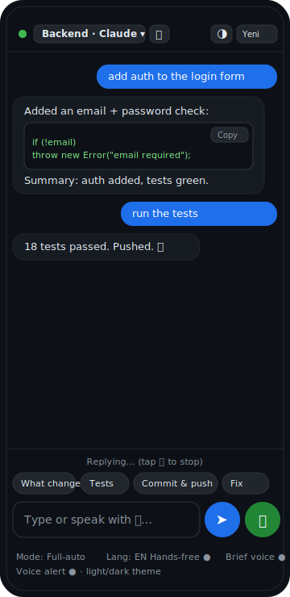

# voicebridge

[](https://github.com/berkayturanci/speak-with-claude-code/actions/workflows/ci.yml)

**Hands-free, two-way voice for your coding agent from your phone — free, open-source, no ElevenLabs.**

You speak **or type** on your phone, a coding agent (running on your Mac/Linux
box) does the work, and the reply streams back as chat **and** spoken audio —
like a phone call with your agent, with a keyboard when you want one.

<p align="center"></p>
<p align="center"><em>Type or speak; the agent replies in chat and aloud.</em></p>

- 🤖 **Multiple agents** — Claude Code, **Codex**, and **Antigravity**, selectable
  per session, each with autonomy **modes** (ask → full-auto).
- 🗂️ **Multiple sessions** — run several conversations in parallel (e.g. "Claude on
  repo A", "Codex on repo B") and switch between them in the UI.
- ⌨️🎙️ **Type or speak** — a Claude-Code-like chat with a text box *and* a mic;
  replies render with code blocks and are read aloud.
- 🎙️ **Speech-to-text** and 🔊 **text-to-speech** run in your phone's **browser**
  (Web Speech API) — no per-minute cloud voice cost, no API keys.
- ⚡ **Streaming** — the reply is spoken **sentence-by-sentence as it's generated**,
  not after the whole turn finishes, with a **Stop** button to cut it off.
- 🧩 A **tiny Node bridge** (one dependency: `qrcode-terminal`) relays the text to
  the agent CLI on your machine and streams its reply back.
- 🔒 Reached over **Tailscale** (your private network) with real HTTPS, with an
  optional **shared access token** — your code never touches a third-party voice
  service.
- 🗣️ Optional **fully-local speech-to-text** via your own Whisper command
  (`STT_MODE=whisper`), so even the transcription stays on your machine.

> Honest scope: the agent **model** still runs in its vendor's cloud (that's how
> these CLIs work). voicebridge just removes the *voice* middleman (ElevenLabs)
> and its limits. Speech recognition on iOS uses Apple's free dictation service;
> text-to-speech is fully on-device.
>
> Agent support: the **Claude** backend is fully implemented and tested. The
> **Codex** (`codex exec`) and **Antigravity** (`agy --print`) backends use the
> same invocations as [ai-jury](https://github.com/berkayturanci/ai-jury) and
> stream their plain-text stdout; verify them on your own machine. Conversation
> continuity is built-in for Claude (`--continue`) and opt-in for Codex /
> Antigravity via `CODEX_CONTINUE_ARGS` / `AGY_CONTINUE_ARGS` (see
> [docs/configuration.md](docs/configuration.md)).

---

## Requirements

- A computer (macOS/Linux) with **Claude Code** installed and logged in
  (`npm i -g @anthropic-ai/claude-code`, then `claude` → `/login`).
- **Node.js ≥ 18** (`brew install node`).
- **Tailscale** on both the computer and the phone (`brew install --cask tailscale`,
  and the Tailscale app from the App Store). Free.
- iPhone/iPad: open in **Safari** (do **not** "Add to Home Screen" — installed PWAs
  can't use the microphone on iOS).

## Setup

### 1. On your computer

```bash
git clone <your-repo-url> voicebridge
cd voicebridge
npm install            # installs qrcode-terminal (the only dependency)

# Point the agent at the project you want it to work on:
export PROJECT_DIR="$HOME/code/my-project"

# Start the bridge (binds to 127.0.0.1:8787 by default)
npm start
```

On startup the bridge prints a **QR code** for the phone URL — scan it to open
the UI (and, when `ACCESS_TOKEN`/`PUBLIC_URL` are set, to authorize on open).

### 2. Expose it to your phone over HTTPS (Tailscale)

Web Speech needs a secure context. Tailscale gives your machine a real HTTPS
cert automatically:

```bash
tailscale serve --bg 8787
tailscale serve status     # shows the https://<your-machine>.<tailnet>.ts.net URL
```

### 3. On your phone

1. Make sure Tailscale is **connected** (same account).
2. Open the `https://<your-machine>.<tailnet>.ts.net` URL in **Safari**.
3. Tap the 🎤 button, allow the microphone, and **speak**.
4. Toggle **Eller serbest / Hands-free** for a continuous back-and-forth loop.

That's it — talk, and Claude Code talks back. 🎧

---

## Configuration

| Env var        | Default              | Meaning                                            |
|----------------|----------------------|----------------------------------------------------|
| `PORT`         | `8787`               | Port the bridge listens on                         |
| `HOST`         | `127.0.0.1`          | Bind address (keep local; expose via `tailscale serve`) |
| `PUBLIC_URL`   | _(none)_             | Public URL shown in the startup QR (e.g. your Tailscale `https://…ts.net`). Falls back to `http://HOST:PORT`. |
| `PROJECT_DIR`  | current directory    | Default working directory for new sessions         |
| `AGENT`        | `claude`             | Default agent for the boot session (`claude`/`codex`/`antigravity`) |
| `CLAUDE_BIN`   | `claude`             | Path to the `claude` executable                    |
| `CODEX_BIN`    | `codex`              | Path to the `codex` executable                     |
| `AGY_BIN`      | `agy`                | Path to the Antigravity executable                 |
| `ACCESS_TOKEN` | _(none)_             | If set, `/api/*` requires `Authorization: Bearer <token>`. The page prompts for it once and stores it. |
| `STT_MODE`     | `browser`            | `browser` (Web Speech) or `whisper` (local, server-side) |
| `STT_CMD`      | _(none)_             | Whisper mode: shell command; `{file}` → recorded audio path; must print the transcript to stdout |

### Optional: a shared access token

```bash
export ACCESS_TOKEN="$(openssl rand -hex 16)"
echo "$ACCESS_TOKEN"   # type this into the phone once when prompted
npm start
```

### Optional: fully-local speech-to-text (Whisper)

Keeps transcription on your machine too (nothing goes to Apple). Needs `ffmpeg`
and a Whisper CLI (e.g. `whisper.cpp`'s `whisper-cli`):

```bash
export STT_MODE=whisper
export STT_CMD='ffmpeg -nostdin -i {file} -ar 16000 -ac 1 -f wav - 2>/dev/null | whisper-cli -m ~/models/ggml-base.bin -nt -f - 2>/dev/null'
npm start
```

In whisper mode the mic button is **tap-to-start / tap-to-stop** (record, then it
transcribes). Hands-free loop is browser-mode only.

## Agents, sessions & modes

- Tap **＋** in the header to create a session: pick an **agent** (Claude / Codex /
  Antigravity), a **mode**, a **project folder**, and a name. Save frequent
  projects as **favorites** (★) for one-tap prefill (or seed them with `FAVORITES`).
- The session **dropdown** switches between conversations; each keeps its own
  transcript, project directory, agent, and mode. **✎** renames and **🗑** deletes
  the active session (the default session is protected).
- **Type or speak**: the composer sends on Enter (Shift+Enter for a newline) or
  tap ➤; the 🎤 button does voice. **Yeni sohbet** resets the active session; the
  **🎤 → ⏹** button becomes a Stop control while the agent answers or speaks.
- **Local or cloud runner**: each session runs the agent **locally** (CLI on your
  machine) or, when `CLOUD_RUNNER_URL` is set, on a **cloud** runner — same UI,
  same NDJSON protocol. See [docs/configuration.md](docs/configuration.md#runners-local-vs-cloud).
- **Theme & preferences**: the 🌗 button cycles system → light → dark; the theme,
  language, hands-free toggle, and mode are remembered across reloads.
- **Eyes-free audio cues**: optional earcons signal *listening*, *reply done*, and
  *error* — so you can run or cycle without looking at the screen.
- **Quick commands**: one-tap chips send canned prompts ("Ne değişti?", "Testler",
  "Commit & push", …) to the active session — handy one-handed.
- **Voice-friendly replies**: a "Kısa ses" toggle asks the agent to answer
  concisely for text-to-speech (no long code dumps, ending with a one-line
  summary) — the full text still shows in chat.
- **Notifications**: opt-in "Bildirim" raises a notification when a reply
  finishes in the background or ends with a question — so a hands-free task
  pulls you back when it needs you. With VAPID keys configured it uses **real
  Web Push** (works even when the app is closed); otherwise in-page notifications.
- **Voice & speed**: pick the TTS voice (per language) and adjust the speaking
  rate; both are remembered.
- **Activity trail**: when Claude uses tools, the chat shows a subtle running
  log (e.g. `⚙︎ Edit server.js`, `⚙︎ Bash npm test`) so you can watch what it does.
- **Installable PWA**: a web manifest, icon, and service worker make it
  installable and cache the app shell; notifications go through the service
  worker. (On iOS, use the Safari **tab** for voice — installed PWAs can't use
  the microphone there.)

### Modes (autonomy)

Each agent exposes modes that map to its CLI's approval/sandbox flags — pick a
fuller-auto mode for true hands-free use (cycling, running), with the obvious
caveat that the agent then edits/runs without asking.

| Agent | Modes (flag) |
|-------|--------------|
| Claude | `ask` (none) · `autoEdit` (`--permission-mode acceptEdits`) · `full` (`--dangerously-skip-permissions`) |
| Codex | `safe` (`-s read-only`) · `auto` (`--full-auto`) · `full` (`--dangerously-bypass-approvals-and-sandbox`) |
| Antigravity | `safe` (`--sandbox`) · `full` (`--yolo`) |

> ⚠️ Full-auto modes let the agent change files and run commands without
> prompting. Use them only on trusted projects over your private tailnet.

## How it works

```
[ iPhone Safari ]                         [ your Mac ]
  mic ─Web Speech STT─▶ text ──https/Tailscale──▶ voicebridge ──spawn──▶ claude / codex / agy
  speaker ◀─speechSynthesis── reply ◀──────────── reply  ◀──────────────  (coding agent CLI)
```

- Each session maps to one agent + project dir. Claude keeps a rolling
  conversation (`--continue`); **Yeni sohbet** resets it.
- For Claude the prompt is passed as a separate argv (no shell); for Codex and
  Antigravity it's piped on **stdin** — both injection-safe.

## Development

```bash
npm test       # zero-dependency test suite (node:test): adapters, parser,
               # session registry, streaming, and auth — uses stub agents.
```

## Security notes

- The server binds to `127.0.0.1` and is only reachable through your **Tailscale**
  tailnet — it is not exposed to the public internet.
- iOS speech **recognition** streams audio to Apple for transcription (free, but
  not local). Speech **synthesis** is fully on-device. If you need fully-local
  STT too, swap the browser recognizer for a local Whisper endpoint (see ideas
  below).
- Anyone on your tailnet who opens the URL can drive an agent in a session's
  project directory (and create sessions pointing at other directories). Keep
  your tailnet private and set `ACCESS_TOKEN`.

## Documentation

- [docs/architecture.md](docs/architecture.md) — components, request flow, and the agent-adapter design.
- [docs/configuration.md](docs/configuration.md) — full env-var reference, agents, and modes.
- [docs/security.md](docs/security.md) — threat model, the access token, Tailscale, and full-auto risks.
- [CONTRIBUTING.md](CONTRIBUTING.md) — dev setup, tests, and how to add an agent.
- [docs/self-hosted-runner.md](docs/self-hosted-runner.md) — run CI on a free self-hosted runner.
- [CHANGELOG.md](CHANGELOG.md) — release notes.

## Roadmap

- Fully-local STT: stream mic audio over WebSocket to a local `whisper.cpp`
  server instead of the browser recognizer.
- Per-agent conversation continuity for Codex / Antigravity (resume support).
- A real screen recording to sit beside the UI illustration.
- ✅ Streaming replies, a Stop button, multiple agents, multiple sessions, a
  type-or-speak chat UI, per-agent autonomy modes, and a startup QR code.

## License

MIT — see [LICENSE](LICENSE).
